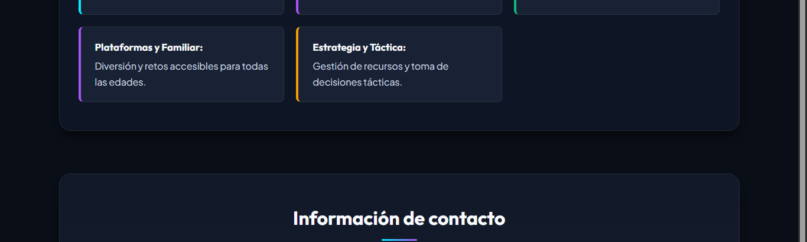

# DOCUMENTO DE EVIDENCIAS Y GUÍA TÉCNICA (SEMANA 2)
## Actividad Formativa: Optimizando la página web con CSS
**Asignatura:** Desarrollo Frontend I (PFY2201)  
**Institución:** Duoc UC Online | Escuela de Informática y Telecomunicaciones  
**Estudiante:** Carolina  
**Archivo CSS:** `Carolina_PFY2201_CSS_Semana2.css`  
**Archivo HTML:** `Carolina_PFY2201_HTML_Semana2.html` (e `index.html` para GitHub Pages)  
**Proyecto:** EriGamesStore — Tienda de Videojuegos Gamer  
**Fecha:** Agosto 2026  

---

## 1. Introducción y Objetivos de la Actividad

El presente informe documenta el cumplimiento integral de la **Semana 2** de la asignatura **Desarrollo Frontend I (PFY2201)**: *"Optimizando la página web con CSS"*.

El objetivo principal fue transformar la estructura HTML5 creada en la Semana 1 en una experiencia visual atractiva, moderna y profesional para la tienda **EriGamesStore**, mediante la implementación de una hoja de estilos externa, el modelo de cajas (Box Model), diseño tipográfico con Google Fonts, una paleta cromática gamer de alto contraste, selectores avanzados y diseño responsivo.

---

## 2. Aplicación del Modelo de Cajas (CSS Box Model)

El modelo de cajas es el núcleo del diseño y maquetación web. Para garantizar un dimensionamiento consistente sin desbordamientos, se aplicó la regla universal:

```css
*,
*::before,
*::after {
    box-sizing: border-box;
    margin: 0;
    padding: 0;
}
```

### Tabla de Aplicación del Modelo de Cajas por Componente:

| Componente / Elemento | Padding (Relleno) | Margin (Margen) | Border y Border-Radius |
| :--- | :--- | :--- | :--- |
| **Cabecera (`header#inicio`)** | `2.5rem 1.5rem 2rem 1.5rem` | `0` (ancho completo) | Borde inferior de `2px solid` con línea de acento neón degradado. |
| **Menú de Navegación (`nav a`)** | `0.65rem 1.35rem` | `gap: 0.75rem` en lista `<ul>` | Borde transparente con `border-radius: 8px` que resalta en `:hover`. |
| **Tarjetas de Producto (`.product-card`)** | `1.75rem` interno uniforme | `gap: 2rem` en CSS Grid | Borde sutil `1px`, `border-radius: 14px`, barra superior temática neón de `4px`. |
| **Botones de Compra (`.btn-buy`)** | `0.85rem 1.25rem` | `margin-top: auto` | `border: none`, `border-radius: 8px`, efecto glow con `box-shadow`. |
| **Categorías (`#categorias li`)** | `1.25rem 1.5rem` | `gap: 1.25rem` en Grid | Borde izquierdo de `4px solid` alternado con `:nth-child()`, `border-radius: 8px`. |
| **Módulos de Contacto (`#contacto li`)** | `1.5rem` interno | `gap: 1.5rem` en Grid | Borde traslúcido `1px solid`, `border-radius: 14px`. |

---

## 3. Paleta Cromática y Tipografía

### 3.1 Variables CSS (`:root`)
Se configuró un sistema de diseño estructurado mediante Custom Properties:

```css
:root {
    --bg-main: #0a0e17;            /* Azul noche oscuro */
    --bg-surface: #111827;         /* Superficie de secciones */
    --bg-card: #182234;            /* Fondo de tarjetas de producto */
    --bg-card-hover: #1e2c42;      /* Estado interactivo */
    --accent-cyan: #00f0ff;        /* Cyan Neón / Enlaces y foco */
    --accent-purple: #a855f7;      /* Morado gamer */
    --accent-green: #10b981;       /* Verde victoria / Precios */
    --accent-gold: #f59e0b;        /* Dorado gamer */
    --text-primary: #f8fafc;       /* Blanco brillante */
    --text-secondary: #cbd5e1;     /* Gris perla de alta legibilidad */
    --text-muted: #94a3b8;         /* Gris para metadatos */
    --font-heading: 'Outfit', sans-serif;
    --font-body: 'Plus Jakarta Sans', sans-serif;
}
```

### 3.2 Tipografías Google Fonts
- **`Outfit` (Pesos 600, 700, 800):** Para títulos (`h1`, `h2`, `h3`), precios y botones.
- **`Plus Jakarta Sans` (Pesos 400, 500, 600):** Para textos de cuerpo, sinopsis y descripciones, con `line-height: 1.65`.

---

## 4. Selectores CSS Avanzados Utilizados

1. **Selectores de Clase e ID:** `.product-card`, `.btn-buy`, `.header-logo`, `#inicio`, `#productos`, `#categorias`, `#contacto`.
2. **Selectores de Hijo Directo y Descendientes:** `#productos ul.products-grid > li`, `nav ul li a`.
3. **Selector Adyacente (`+`):** `section h2 + p` para centrar y dimensionar el subtítulo descriptivo que acompaña a cada encabezado.
4. **Pseudo-clase `:nth-child()`:**
   - Personalización temática individual de cada tarjeta de juego: `:nth-child(1)` Zelda (verde/cyan), `:nth-child(2)` Cyberpunk (amarillo/rojo), `:nth-child(3)` Mario (rojo/azul), `:nth-child(4)` FC 24 (verde/azul).
   - Alternancia de colores en categorías: `:nth-child(even)`, `:nth-child(3)`, `:nth-child(5)`.
5. **Pseudo-clases de Interacción:** `:hover`, `:active`, `:focus-visible` con micro-interacciones de elevación (`transform: translateY(-8px)`).
6. **Selectores de Atributo:** `a[href^="tel:"]`, `a[href^="mailto:"]`, `a[target="_blank"]`.
7. **Pseudo-elementos:** `::before` y `::after` para efectos de barra neón y `::selection` para el resaltado de texto.

---

## 5. Evidencias Visuales de Funcionamiento (Capturas)

### 5.1 Vista General del Sitio Web en Escritorio

*Figura 1: Vista general del sitio web «EriGamesStore» con estilos CSS aplicados.*

---

### 5.2 Cabecera y Menú de Navegación

*Figura 2: Cabecera con logotipo oficial, tipografía degradada y menú de navegación fijo.*

---

### 5.3 Catálogo de Productos Destacados (Modelo de Cajas en Tarjetas)

*Figura 3: Catálogo con diseño en cuadrícula (CSS Grid), tarjetas con modelo de cajas y botones de compra con efecto glow.*

---

### 5.4 Categorías de Videojuegos con `:nth-child()`

*Figura 4: Sección de categorías con bordes laterales alternados mediante el selector :nth-child().*

---

### 5.5 Información de Contacto

*Figura 5: Módulos de contacto con selectores de atributo para teléfonos y correo electrónico.*

---

### 5.6 Pie de Página y Redes Sociales

*Figura 6: Pie de página con enlaces a redes sociales y créditos institucionales de Duoc UC.*

---

### 5.7 Vista Responsiva Móvil (Mobile Friendly)

*Figura 7: Visualización responsiva fluida en dispositivos móviles mediante Media Queries.*

---

## 6. Guía Paso a Paso para la Entrega y Publicación

### Paso 1: Subir el archivo CSS en la plataforma AVA
- Nombrado de archivo: `Carolina_PFY2201_CSS_Semana2.css`
- Subir este archivo directamente en la entrega de la Semana 2 en AVA Duoc UC.

### Paso 2: Subir el Proyecto a GitHub
Crear un repositorio público llamado `PFY2201-EriGamesStore` y subir los archivos:
- `index.html` (y `Carolina_PFY2201_HTML_Semana2.html`)
- `styles.css` (y `Carolina_PFY2201_CSS_Semana2.css`)
- `img/erigames-logo.jpg`
- `screenshots/`

### Paso 3: Despliegue en GitHub Pages (`gh-pages`)
Ejecuta los siguientes comandos en tu terminal Git:

```bash
# 1. Iniciar git y agregar archivos
git init
git add .
git commit -m "Semana 2: Optimizacion visual con CSS, Box Model y Selectores Avanzados"

# 2. Conectar repositorio remoto
git branch -M main
git remote add origin https://github.com/TU_USUARIO/PFY2201-EriGamesStore.git
git push -u origin main

# 3. Publicar en rama gh-pages
git checkout -b gh-pages
git push -u origin gh-pages
```

**URL Pública de GitHub Pages:**  
`https://TU_USUARIO.github.io/PFY2201-EriGamesStore/`

---

## 7. Matriz de Cumplimiento de la Pauta de Evaluación

| Criterio de Evaluación | Nivel de Logro | Justificación y Evidencia en el Proyecto |
| :--- | :---: | :--- |
| **1. Hoja de estilos externa vinculada sin errores** | **CL (100%)** | Archivo `Carolina_PFY2201_CSS_Semana2.css` enlazado con `<link rel="stylesheet">` en el `<head>`. Sintaxis válida y estructura limpia. |
| **2. Modelo de cajas con padding, margin, border y box-sizing** | **CL (100%)** | `box-sizing: border-box` universal. Rellenos uniformes, separación entre secciones y bordes redondeados en todas las tarjetas. |
| **3. Definición de colores y tipografías para fondo, texto y bordes** | **CL (100%)** | Paleta gamer neón con alto contraste visual (WCAG). Tipografías Google Fonts `Outfit` y `Plus Jakarta Sans`. |
| **4. Uso de selectores avanzados (clases, ID, pseudo-clases)** | **CL (100%)** | Selectores de clase, ID, atributos (`[href^="tel:"]`), pseudo-clases `:nth-child()` temáticos y `:hover` interactivo. |
| **5. Verificación en navegadores y diseño responsivo** | **CL (100%)** | Visualización validada en Edge, Chrome y adaptable a pantallas móviles con Media Queries fluidas. |
