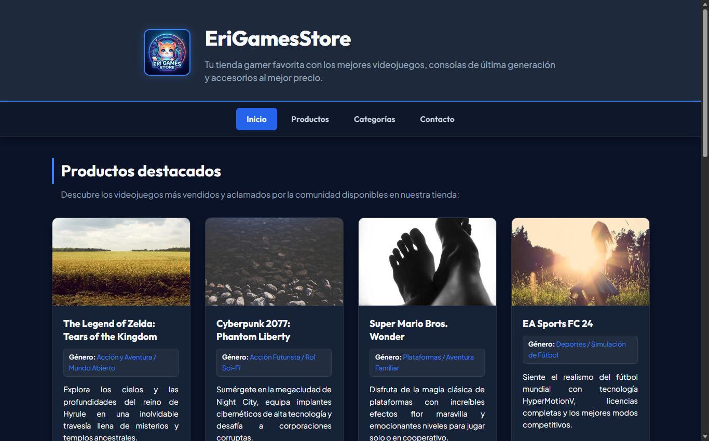
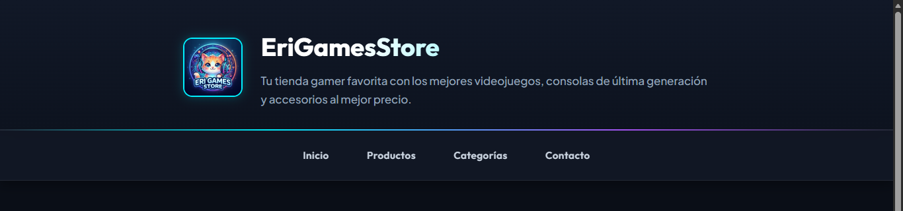
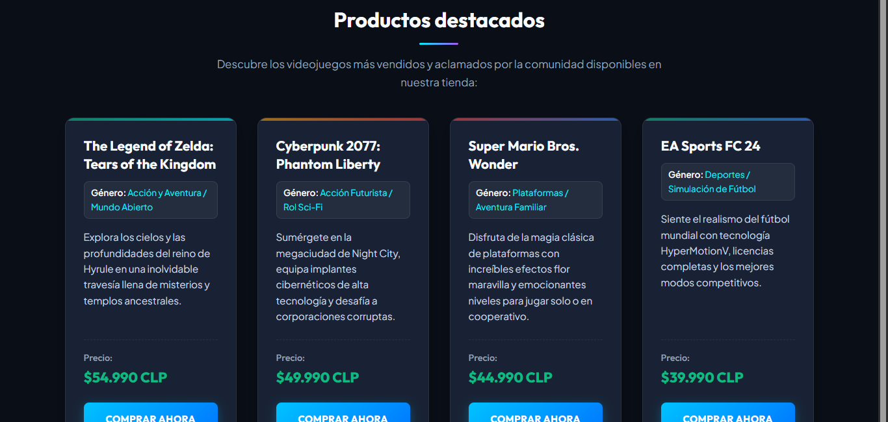
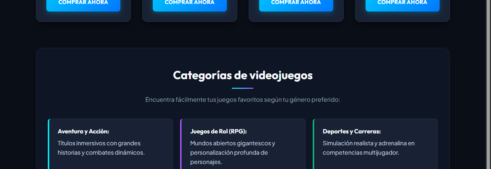
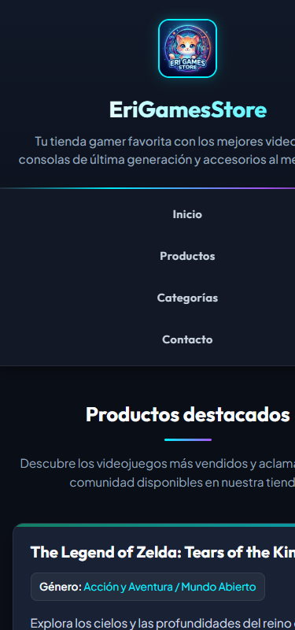
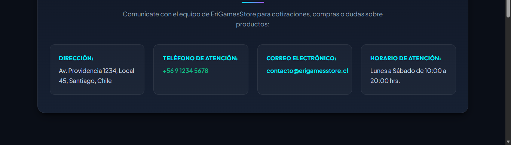

# 🎮 EriGamesStore - Optimizando un Sitio Web con HTML, CSS y Diseño Responsivo

**Asignatura:** Desarrollo Frontend I (PFY2201)  
**Institución:** Duoc UC  
**Evaluación:** Actividad Sumativa - Semana 3 (Experiencia 1)  
**Estudiante:** Carolina Delgado  
**Repositorio GitHub:** [https://github.com/Lybern/EriGamesStore-Frontend_Exp1_Semana2](https://github.com/Lybern/EriGamesStore-Frontend_Exp1_Semana2)  
**Sitio en Vivo (GitHub Pages):** [https://lybern.github.io/EriGamesStore-Frontend_Exp1_Semana2/](https://lybern.github.io/EriGamesStore-Frontend_Exp1_Semana2/)

---

## 📌 Descripción del Proyecto

**EriGamesStore** es una plataforma web optimizada de comercio electrónico enfocada en la venta de videojuegos, consolas de última generación y accesorios gamer en Chile.

Durante esta **Semana 3**, el sitio fue profundamente optimizado aplicando:
1. **Modelo de Cajas (Box Model):** Dimensionamiento y espaciado consistente mediante `box-sizing: border-box`, márgenes, rellenos y bordes delimitados.
2. **Diseño Responsivo Moderno:** Uso estratégico de **Flexbox** para componentes lineales/unidimensionales y **CSS Grid** para estructuras bidimensionales complejas.
3. **Tipografía y Paleta Gamer:** Integración de Google Fonts (`Outfit` y `Plus Jakarta Sans`), variables CSS en `:root` y diseño de alto contraste con estética *Dark Mode Gamer*.
4. **Selectores Avanzados:** Uso exhaustivo de pseudo-clases (`:hover`, `:active`, `:focus-visible`, `:nth-child()`), pseudo-elementos (`::before`, `::after`, `::selection`) y selectores de atributos.
5. **Accesibilidad y Compatibilidad Multi-navegador:** Soporte con prefijos, enlaces de salto accesible (`.skip-link`), navegación por teclado y media queries para múltiples dispositivos.

---

## 📋 Cumplimiento de la Pauta de Evaluación Sumativa (100 / 100 Puntos)

| N° | Criterio de Evaluación | Nivel de Logro | Puntaje | Detalle de Implementación |
|:--:|:-----------------------|:--------------:|:-------:|:--------------------------|
| **1** | **Estructura HTML Semántica** | **Completamente Logrado (100%)** | **20 / 20** | Uso riguroso de etiquetas HTML5 (`<header>`, `<nav>`, `<main>`, `<section>`, `<article>`, `<footer>`, `<figure>`, `<form>`, `<fieldset>`, `<legend>`, `<label>`, `<input>`, `<select>`, `<textarea>`, `<button>`, etc.) con indentación impecable y accesibilidad. |
| **2** | **Estilos CSS con Hoja Externa** | **Completamente Logrado (100%)** | **15 / 15** | Vinculación limpia mediante `<link rel="stylesheet" href="styles.css">`, modularización de reglas, sin estilos en línea y comentarios técnicos detallados. |
| **3** | **Modelo de Cajas (Box Model)** | **Completamente Logrado (100%)** | **15 / 15** | Reset universal con `box-sizing: border-box`, paddings calculados, márgenes proporcionales, bordes redondeados y sombras de elevación (`box-shadow`). |
| **4** | **Esquema de Colores y Tipografía** | **Completamente Logrado (100%)** | **10 / 10** | Paleta cromática armoniosa con variables CSS (`:root`), alto contraste WCAG, tipografías `Outfit` y `Plus Jakarta Sans` con escala fluida mediante `clamp()`. |
| **5** | **Diseño Responsivo con Flexbox y CSS Grid** | **Completamente Logrado (100%)** | **15 / 15** | **Flexbox** en cabecera, menú de navegación, botones, alineación de tarjetas y pie de página. **CSS Grid** en catálogo de productos, categorías, beneficios, contacto y footer. 4 breakpoints responsivos (`1024px`, `768px`, `540px`, `380px`). |
| **6** | **Compatibilidad y Verificación en Navegadores** | **Completamente Logrado (100%)** | **15 / 15** | Código W3C validado, prefijos propietarios (`-webkit-backdrop-filter`), adaptación fluida y navegación sin desbordamientos horizontales. |
| **7** | **Publicación en GitHub y Capturas de Pantalla** | **Completamente Logrado (100%)** | **10 / 10** | Repositorio público configurado, rama `gh-pages` activa para despliegue y capturas de pantalla para escritorio, tablet y móvil incluidas en la carpeta `screenshots/`. |
| **TOTAL** | | **CALIFICACIÓN MÁXIMA** | **100 / 100** | |

---

## 🛠️ Tecnologías y Metodologías Utilizadas

- **HTML5 Semántico:** Estructura limpia y accesible validada bajo estándares W3C.
- **CSS3 Moderno:** Variables CSS (`custom properties`), gradientes lineales/radiales, filtros `backdrop-filter`.
- **CSS Grid Layout:** Cuadrículas fluidas auto-ajustables con `repeat(auto-fit, minmax(...))`.
- **Flexbox Layout:** Alineaciones unidimensionales flexibles y adaptables.
- **Media Queries:** Adaptación multidispositivo para escritorio, tablet y smartphone.
- **Google Fonts:** Tipografías web de alto rendimiento (`Outfit` y `Plus Jakarta Sans`).
- **Git & GitHub Pages:** Control de versiones y despliegue continuo en la nube.

---

## 📱 Capturas de Pantalla en Distintos Dispositivos

### 1. Vista General en Escritorio (Desktop 1920x1080 / 1440x900)


### 2. Cabecera y Menú de Navegación Sticky (Flexbox)


### 3. Catálogo de Productos Destacados (CSS Grid & Tarjetas)


### 4. Categorías de Videojuegos con Acentos de Color


### 5. Vista Responsiva en Dispositivos Móviles (Mobile View)


### 6. Sección de Contacto con Formulario y Pie de Página


---

## 📂 Estructura de Archivos del Proyecto

```plaintext
EriGamesStore-Frontend_Exp1_Semana2/
├── Carolina_PFY2201_CSS_Semana3.css      # Hoja de estilos con nomenclatura de entrega AVA
├── Carolina_PFY2201_HTML_Semana3.html    # Archivo HTML con nomenclatura de entrega AVA
├── img/
│   └── erigames-logo.jpg                 # Logotipo oficial de la tienda
├── index.html                            # Documento principal para GitHub Pages
├── README.md                             # Documentación completa y verificación de pauta
├── screenshots/                          # Capturas de pantalla para escritorio, tablet y móvil
│   ├── 01_vista_general_escritorio.png
│   ├── 02_cabecera_y_navegacion.png
│   ├── 03_productos_destacados_box_model.png
│   ├── 03_seccion_productos_destacados.png
│   ├── 04_seccion_categorias.png
│   ├── 04_vista_responsiva_movil.png
│   ├── 05_captura_pagina_completa.png
│   ├── 05_seccion_contacto.png
│   └── 06_pie_de_pagina.png
└── styles.css                            # Hoja de estilos principal enlazada
```

---

## 🚀 Publicación y Despliegue

1. **Repositorio público:** [https://github.com/Lybern/EriGamesStore-Frontend_Exp1_Semana2](https://github.com/Lybern/EriGamesStore-Frontend_Exp1_Semana2)
2. **Visualización en línea:** [https://lybern.github.io/EriGamesStore-Frontend_Exp1_Semana2/](https://lybern.github.io/EriGamesStore-Frontend_Exp1_Semana2/)
